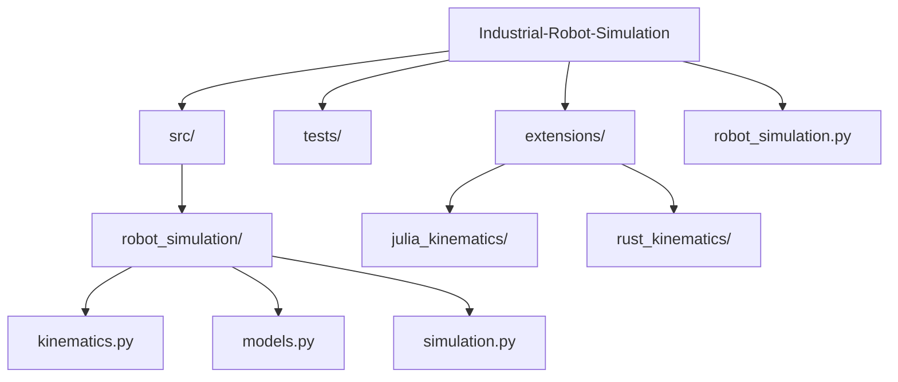
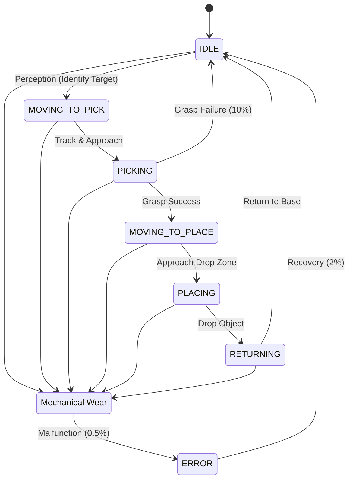

# Industrial Robot Simulation


A modular, kinematics-based simulation of an industrial robot arm performing pick-and-place operations on a conveyor belt.

## Overview

This project simulates a 2-degree-of-freedom (2-DOF) planar robot arm in a manufacturing environment. It includes a mathematical implementation of forward and inverse kinematics, a stochastic environment with conveyor-driven objects, and a visualization engine using Matplotlib.

### Project Structure



## Mathematical Foundation

The robot uses a 2-link planar kinematics model.

### Forward Kinematics
Given joint angles $\theta_1$ and $\theta_2$, the end-effector position $(x, y)$ is:
$$x = L_1 \cos(\theta_1) + L_2 \cos(\theta_1 + \theta_2)$$
$$y = L_1 \sin(\theta_1) + L_2 \sin(\theta_1 + \theta_2)$$

### Inverse Kinematics
To reach a target $(x, y)$, the joint angles are calculated using the Law of Cosines:
$$\cos(\theta_2) = \frac{x^2 + y^2 - L_1^2 - L_2^2}{2 L_1 L_2}$$
$$\theta_1 = \text{atan2}(y, x) - \text{atan2}(L_2 \sin(\theta_2), L_1 + L_2 \cos(\theta_2))$$

## Simulation & Inference

The simulation operates on a discrete-time loop where the robot acts as an intelligent agent with the following inference pipeline:

1.  **Perception**: The agent scans the "Pickup Zone" (a specific $x$-range on the conveyor) to identify the item closest to the exit.
2.  **Path Inference**: Using the target's current $(x, y)$ coordinates, the robot calculates the required joint configurations $(\theta_1, \theta_2)$ using the Inverse Kinematics solver.
3.  **Motion Planning**: The robot moves its joints at a fixed angular velocity toward the calculated target configuration.
4.  **Stochastic Execution**: 
    *   **Grasp Inference**: Upon reaching the object, a probabilistic check (10% failure rate) determines if the grasp was successful.
    *   **System Reliability**: A 0.5% failure chance per frame simulates mechanical wear, requiring a system "recovery" state.

This loop ensures that the simulation is not just a playback of an animation, but a responsive system that adapts to the moving objects on the conveyor belt.

### Inference Flow



## Features

- **2-Link Kinematics**: Fully implemented analytical IK solver.
- **Stochastic Environment**: Random mechanical failures and grasp misses.
- **Real-time Visualization**: Interactive Matplotlib-based display.
- **Modular Design**: Separated concerns into `src/robot_simulation/`.
- **Unit Testing**: Automated tests for mathematical correctness.
- **Multi-Language Support**: High-performance extensions in Julia and Rust.

## Multi-Language Extensions

To promote code diversity and performance benchmarking, this project includes alternative implementations of the core kinematics engine:

- **Julia** (`extensions/julia_kinematics/`): Leverages Julia's mathematical efficiency for numerical computing.
- **Rust** (`extensions/rust_kinematics/`): A memory-safe, high-performance implementation focused on systems-level robotics.

## Getting Started

### Prerequisites

- Python 3.7+
- NumPy
- Matplotlib

### Installation

```bash
git clone https://github.com/ashishrai12/Industrial-Robot-Simulation.git
cd Industrial-Robot-Simulation
pip install -r requirements.txt
```

### Running the Simulation

```bash
python robot_simulation.py
```

### Running Tests

```bash
python -m unittest discover tests
```

## Contributing

Contributions are welcome! Please feel free to submit a Pull Request.

## License

This project is licensed under the MIT License - see the `LICENSE` file for details.
